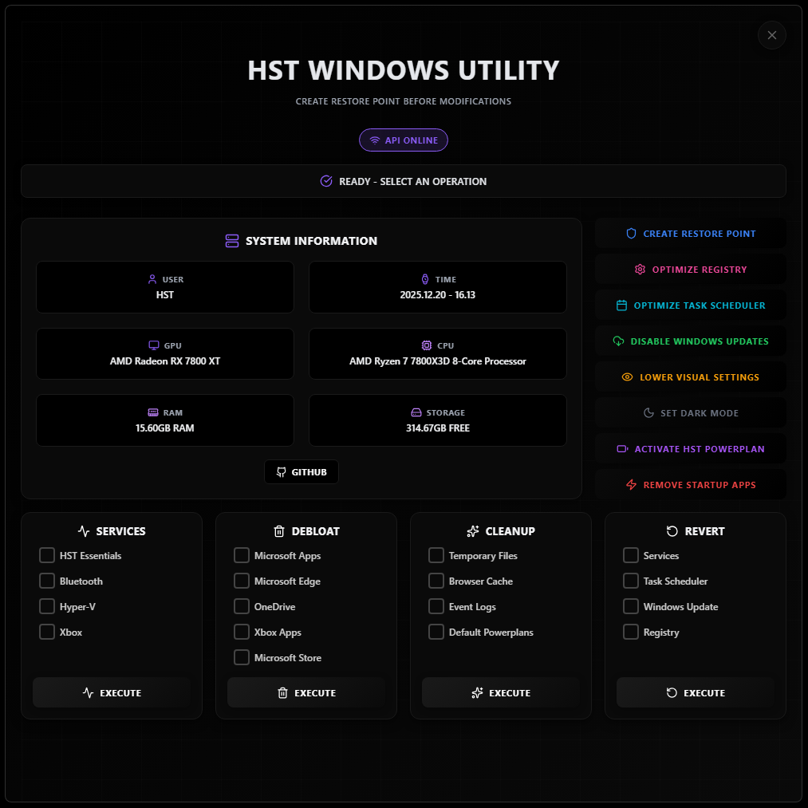
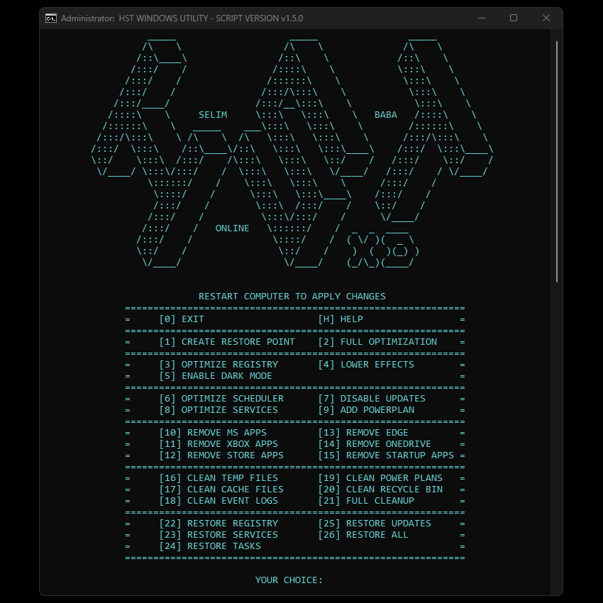

# HST WINDOWS UTILITY

---

## 🚀 Choose Your Version

<table align="center">
<tr>
<td align="center" width="50%">

### 🖥️ GUI

</td>
<td align="center" width="50%">

### ⌨️ CLI

</td>
</tr>
<tr>
<td align="center">

</td>
<td align="center">

</td>
</tr>
</table>

**Windows optimization tools designed to maximize system performance through registry tweaks, service management, and system cleanup. Perfect for gamers and power users seeking maximum hardware efficiency.**

---

### ⚠️ WARNINGS

> **🛡️ Always create a restore point before using this tool**

> **☁️ OneDrive Removal**: Disable all OneDrive backup features before removal to prevent data loss

> **❗ If issues occur** run it again as administrator and check antivirus isn't blocking it

---

## ✨ Features

### 🛡️ System Management

- **Restore Point Creation** - Automatic system restore points for safe rollback
- **Registry Optimization** - 500+ performance-focused registry tweaks
- **Task Scheduler** - Disable unnecessary scheduled tasks
- **Windows Updates** - Control automatic updates
- **Visual Effects** - Reduce animations for better performance
- **Dark Mode** - System-wide dark theme
- **Power Plan** - Custom high-performance power plan

### ⚙️ Services Management

- ✅ 99+ recommended services disabled
- 🔵 Bluetooth services
- 💻 Hyper-V virtualization
- 🎮 Xbox gaming services

### 🧹 System Cleanup & Debloat

- 📁 Temporary files removal
- 🌐 Browser cache cleanup
- 📊 Event logs cleanup
- ⚡ Unused power plans removal
- 🗑️ Remove MS Apps / Xbox Apps / Store Apps
- 🌐 Remove Edge / OneDrive

---

## 🛠️ Tech Stack

**Backend**
- C# / ASP.NET Core Web API
- Windows Management APIs
- PowerShell Integration
- System Registry Access

**Frontend (GUI)**
- React
- JavaScript
- Lucide Icons
- Electron Desktop

**CLI**
- Batch scripting
- Native Windows commands
- Same optimizations as GUI

---

## 🔧 System Requirements

**Minimum:**
- Windows 10 (64-bit) or later
- Administrator privileges
- 100 MB free disk space
- .NET 8.0 Runtime (GUI only, included in .exe)

---

## 👨‍💻 Development

**What I Built:**
- ✅ Complete C# backend with Windows system APIs
- ✅ Batch and PowerShell scripts/commands
- ✅ All optimization logic and safety checks
- ✅ Years of Windows tweaking knowledge
- ✅ CLI version with 20+ optimization modules
- ✅ Full integration and testing

**AI-Assisted:**
- 🤖 React frontend UI
- 🤖 Electron packaging setup
- 🤖 Build configuration

---

## 🤝 Contributing

Contributions are welcome! See [CONTRIBUTING.md](CONTRIBUTING.md) for guidelines.

---

## 📞 Contact

