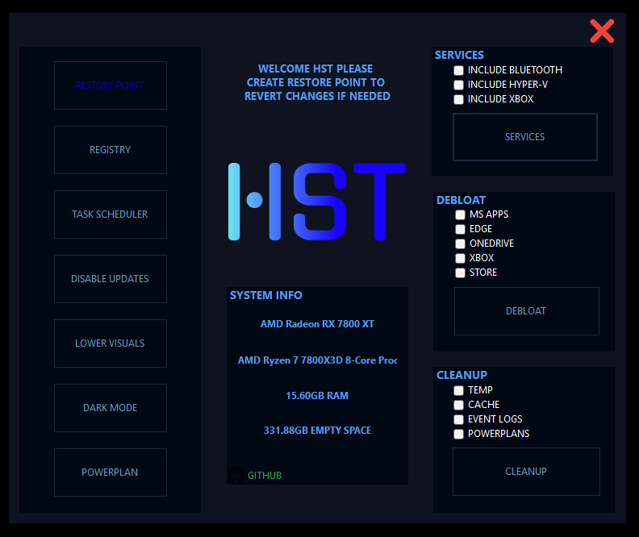

# HST WINDOWS UTILITY

## Overview

Windows utility designed to optimize your system's performance by providing easy access to various system configurations and tweaking options. It's perfect for gamers looking to maximize their hardware efficiency.

**Always create a restore point before using this tool**

**Debloat section currently under work because Windows 11 24h2's new update causing errors but you can use debloat.bat which is included in release**

### System Management
- **Restore Point Creation**: Create system restore points before making changes to ensure you can revert if needed
- **Registry Optimization**: Apply registry tweaks
- **Task Scheduler Management**: Disable unnecessary scheduled tasks that consume system resources
- **Windows Updates Control**: Disable Windows updates to prevent unwanted system changes and resource usage
- **Visual Effects**: Lower visual effects to improve performance
- **Dark Mode**: Switch Windows to dark mode
- **Custom Power Plan**: Apply an optimized power plan for maximum performance

### Services Management
- Selectively disable non-essential Windows services while maintaining system stability
- Customizable service disabling with options for:
  - Bluetooth services
  - Hyper-V virtualization services
  - Xbox gaming services

### System Cleanup
- **Temporary Files**: Remove temporary files that accumulate over time
- **Browser Cache**: Clear browser cache files to free up disk space
- **Event Logs**: Clean up system event logs
- **Power Plans**: Remove unused power plans

## System Requirements

HST has been tested on the following system configurations:
- Windows 10/11 (64-bit)
- .NET should be installed or you can install it when you run executable
- Administrator privileges required

## Installation

1. Download the latest release from [Release](https://github.com/hselimt/HST-WINDOWS-UTILITY/releases/tag/v1.0)
3. Run `HST WINDOWS UTILITY.exe`
