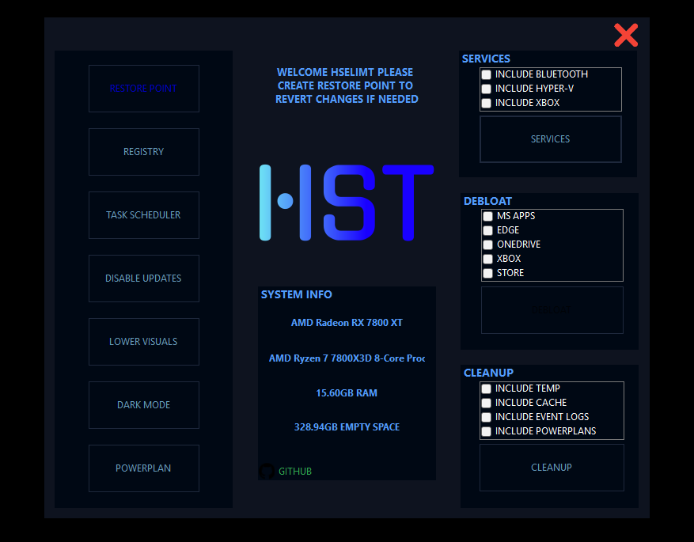

# HST WINDOWS UTILITY

## Overview
HST WINDOWS UTILITY is a powerful Windows utility designed to optimize your system's performance by providing easy access to various system configurations and tweaking options. It's perfect for gamers looking to maximize their hardware efficiency.

**Always create a restore point before using this tool**

**If you plan to remove OneDrive with this tool, make sure to disable all backup features first. Otherwise, essential folders like Documents and Desktop that OneDrive is backing up will be deleted**

### System Management
- **Restore Point Creation**: Manually create system restore points to ensure you can revert changes if needed
- **Registry Optimization**: Apply registry tweaks
- **Task Scheduler Management**: Disable unnecessary scheduled tasks
- **Windows Updates Control**: Disable Windows updates
- **Visual Effects**: Lower visual effects
- **Dark Mode**: Switch Windows to dark mode
- **HST Power Plan**: Apply HST power plan for maximum performance

### Services Management
- disable non-essential Windows services while maintaining system stability
- Customizable service disabling with options for:
  - Bluetooth services
  - Hyper-V virtualization services
  - Xbox gaming services

### System Cleanup
- **Temporary Files**: Remove temporary files
- **Browser Cache**: Clear Chrome browser cache (Will be updated)
- **Event Logs**: Clean up system event logs
- **Power Plans**: Remove default power plans

## System Requirements
- Windows 10/11 (64-bit)
- .NET should be installed or you can install it when you run the executable
- Runs with Administrator privileges

## Installation
1. Download the latest release from the [BETA RELEASE](https://github.com/hselimt/HST-WINDOWS-UTILITY/releases/tag/v1.0-beta)
2. Run `HST WINDOWS UTILITY.exe`
