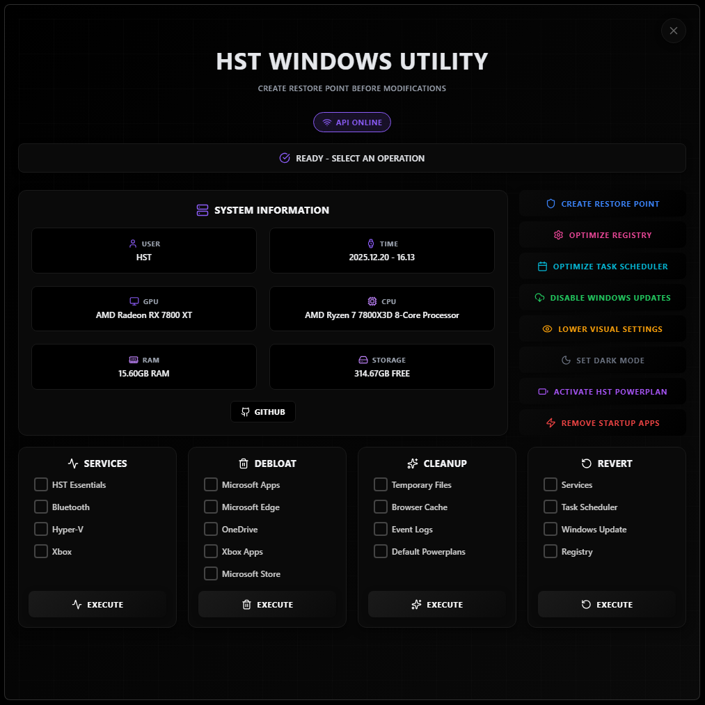
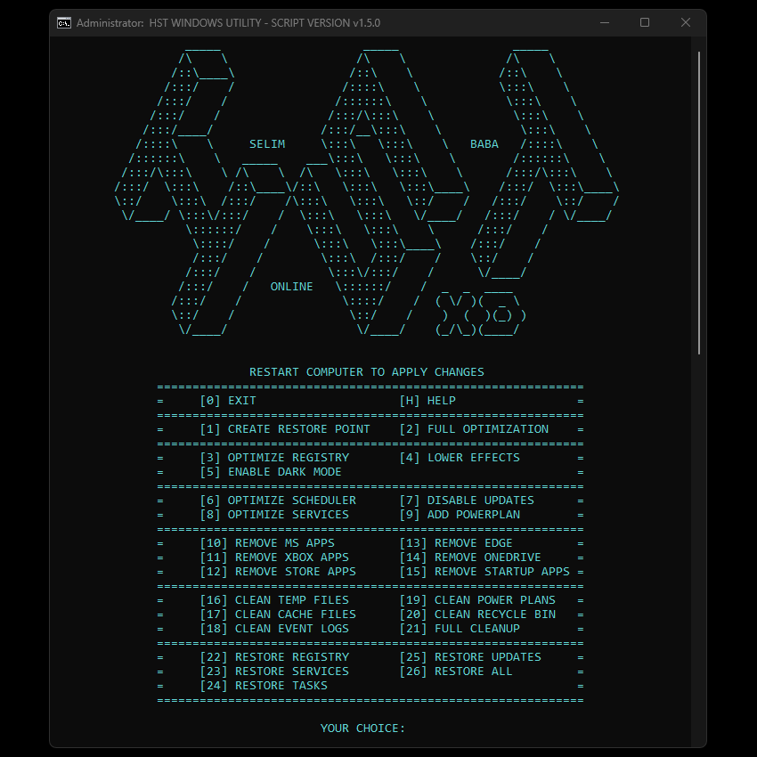
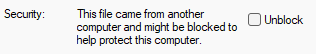

  
# HST WINDOWS UTILITY

**Windows optimization tools designed to maximize system performance through registry tweaks, service management, and system cleanup. Perfect for gamers and power users seeking maximum hardware efficiency.**

> [!WARNING]
> In the current state of Windows with all the different hardware, software, and configurations people run, it's impossible to create a utility that suits every user's needs out of the box. That's why every feature is fully documented both in the GUI (? icon in top-right) and the CLI ([H] Help). **Read the documentation before running any features** so you know what to expect and what might not work well with your specific setup.

>  **Tutorial recorded on:** Fresh Windows 11 25H2 → Updated → Installed browser → Restarted - Make sure you have a stable GPU driver installed

https://github.com/user-attachments/assets/063aa012-9401-460f-9741-def6cb5f6398

<table>
<tr>
<td align="center"><b>🖥️ GUI</b></td>
<td align="center"><b>⌨️ CLI</b></td>
</tr>
<tr>
<td></td>
<td></td>
</tr>
</table>

---

## ⚠️ Before You Use

**This tool makes aggressive system changes.** Ideal for: gaming desktops, fresh Windows installs, power users who know what they're doing.

### ⛔ Critical

| Warning | Why it matters |
|---------|----------------|
| **Create a restore point first** | Built-in button available — use it before any changes |
| **OneDrive removal deletes files** | Synced files are removed. Disable sync first |
| **App removals are permanent** | Microsoft Store apps need Windows reset to restore |
| **Revert ≠ Undo** | Restores Windows defaults, not your custom settings |

<b>🛠️ Troubleshooting</b>

| Issue | Fix |
|-------|-----|
| Operations fail silently | Must run as Administrator |
| HST-W-U won't start | Unblock the .exe (Properties → Unblock) |
| Apps won't start | Revert Services and registry tweaks |
| Config file error | Re-run as Administrator |
| Need to see what happened | Check `%TEMP%\HST-WINDOWS-UTILITY.log` |
| Need to undo everything | Revert panel or Windows System Restore |
| Microsoft Account can't sign-in | Revert Services, or enable wlidsvc in services.msc |

<b>🚫 Skip these features if...</b>

| Your situation | What to skip | Why |
|----------------|--------------|-----|
| Laptop user | Power plan, registry tweaks | Kills battery life, breaks sleep/hibernate |
| VM user (VirtualBox, Hyper-V, etc.) | Registry tweaks, Hyper-V services | Breaks guest integration, snapshots |
| Work/School PC | Windows Update toggle | IT policies will conflict or flag you |
| Use a printer | Recommended services | Disables Print Spooler |
| Bluetooth headphones/mouse | Bluetooth services | Devices won't connect |
| Remote Desktop user | Recommended services | Disables RDP services |
| Realtek 2.5GbE Ethernet | Power plan | Driver may not initialize after cold boot, you would have to restart |
| Web Applications | HST Essential Services | Some web apps requires some services that this software disables |

<b>🔧 What registry optimization actually does</b>

| Disabled | What breaks |
|----------|-------------|
| Game Bar & DVR | No Xbox overlay, no clip recording, no Game Bar streaming |
| Location services | Weather widgets, Maps, "Find My Device" won't work |
| Background apps | Apps won't update or sync when minimized |
| Notifications | No toast notifications from any app |
| Search indexing | File searches become slower |
| Windows Spotlight | No automatic lock screen wallpapers |
| Mouse acceleration | Raw 1:1 input — feels "slow" at first if you're used to acceleration |

**Still enabled:**
- Defender real-time protection (only scheduled scans disabled)
- Firewall
- Core security features

**Manually reversible:**
- Webcam: Settings → Privacy → Camera
- Location: Settings → Privacy → Location
- Notifications: Settings → System → Notifications

---

### 📥 Download

**After downloading Right-click .exe → Properties → Check "Unblock" → Apply → Run as Administrator**

---

## ✨ Features

### 🛡️ System Management
- **Restore Point Creation** — Automatic system restore points for safe rollback
- **Registry Optimization** — 120+ performance-focused tweaks (gaming, latency, privacy, telemetry)
- **Task Scheduler** — Disable 60+ unnecessary scheduled tasks
- **Windows Updates** — Disable automatic updates and delivery optimization
- **Visual Effects** — Reduce animations for better performance
- **Dark Mode** — System-wide dark theme toggle
- **Power Plan** — Custom high-performance power plan
- **Startup Apps** — Remove common apps from startup (Discord, Steam, Spotify, etc.)
- **Logging** — All operations logged to `%TEMP%\HST-WINDOWS-UTILITY.log`

### ⚙️ Services Management
Disable services by category:
| Category | Count | Examples |
|----------|-------|----------|
| Recommended | 107 | Telemetry, diagnostics, rarely-used services |
| Bluetooth | 5 | Audio gateway, support services |
| Hyper-V | 11 | All virtualization services |
| Xbox | 4 | Game save, networking, auth |

### 🧹 Cleanup & Debloat
- **Temp files** — Windows temp, user temp, prefetch
- **Cache** — Chrome cache, Windows Update cache
- **Event logs** — Clear all Windows logs
- **Power plans** — Remove default Windows plans
- **Debloat** — Remove 45+ Microsoft apps, Edge, OneDrive, Xbox apps, Store

---

## 🧪 Testing & Validation

To ensure system stability and safety, every function in this utility has been tested across multiple clean installation environments using virtual machines

| Operating System | Version | Status |
|------------------|---------|--------|
| Windows 10 | 22H2 | ✅ Verified |
| Windows 11 | 21H2 | ✅ Verified |
| Windows 11 | 22H2 | ✅ Verified |
| Windows 11 | 23H2 | ✅ Verified |
| Windows 11 | 24H2 | ✅ Verified |
| Windows 11 | 25H2 | ✅ Verified |

### Quality Assurance Process

- **Environment:** Tests were conducted on VirtualBox and Hyper-V simulating fresh Windows installations to isolate variables
- **Coverage:** Each button, toggle, and script was executed multiple times individually to verify functionality
- **Reversibility:** Revert functions were tested to ensure systems could be returned to default states without errors

---

## 🛠️ Tech Stack

| Component | Technologies |
|-----------|--------------|
| **Backend** | C# / ASP.NET Core 8, PowerShell, Windows Registry APIs |
| **Frontend** | React 18, Electron 27, Lucide Icons |
| **CLI** | Batch scripting, native Windows commands |

---

## 🔧 Requirements For GUI

- Windows 10/11 (64-bit)
- Administrator privileges
- 100 MB disk space
- .NET 8.0 Runtime (included in GUI executable)

---

## 👨‍💻 Development

**What I Built:**
- Years of Windows tweaking knowledge
- Complete C# backend with Windows system APIs
- Batch and PowerShell scripts/commands
- All optimization logic and safety checks
- CLI version with 20+ optimization modules
- Full integration and testing

**AI-Assisted:**
- React frontend UI
- Electron packaging setup
- Build configuration

---

## 🤝 Contributing

See [CONTRIBUTING.md](CONTRIBUTING.md) for guidelines.

---

## 📞 Contact

